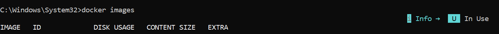
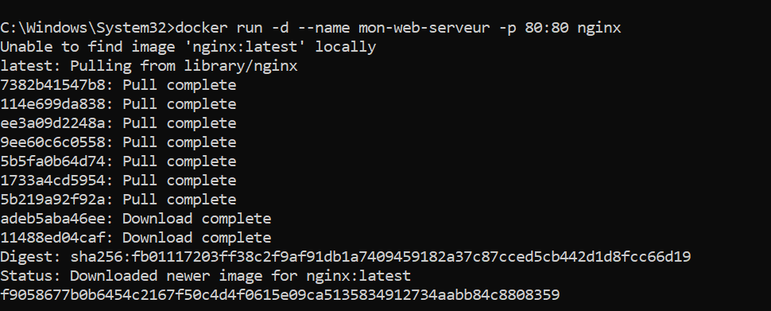
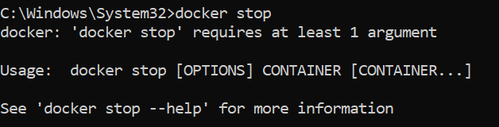
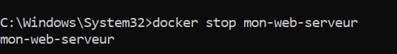
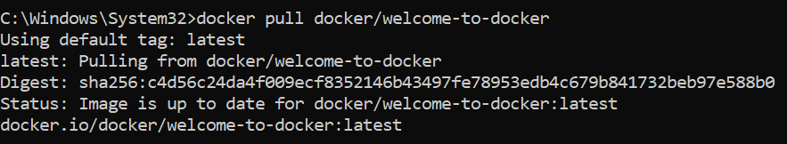
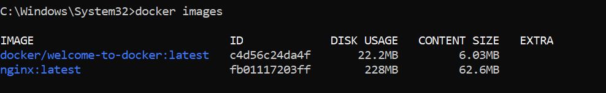
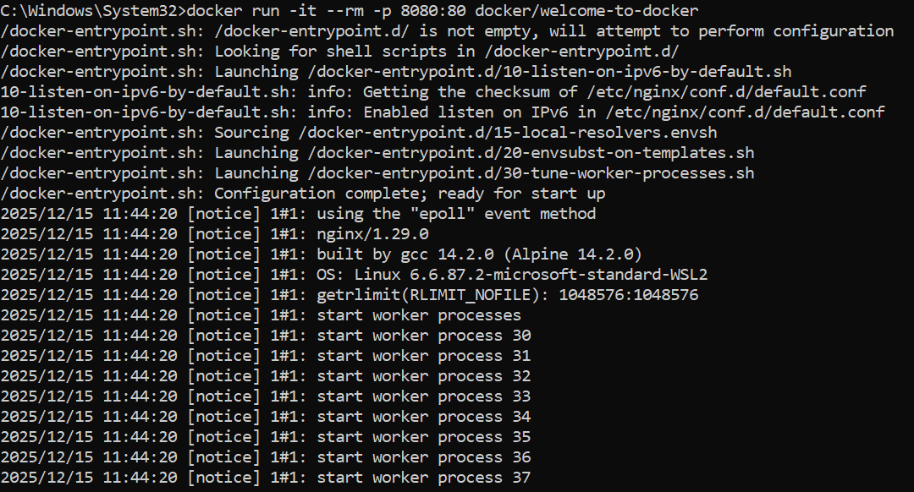

Vérifier la version d'installation de docker avec la commande:
docker --version

Test des commandes de bases:
docker info

docker ps

docker images

docker run

docker run -d --name mon-web-serveur -p 80:80 nginx

docker stop

docker stop mon-web-serveur

Récupérer l’image Docker:

docker pull

docker images

Construction du container Docker
docker run -it --rm -p 8080:80 docker/welcome-to-docker

