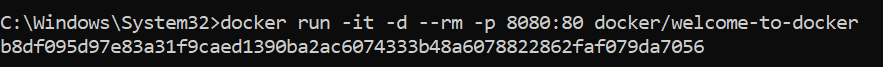
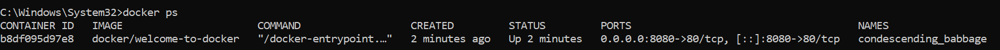
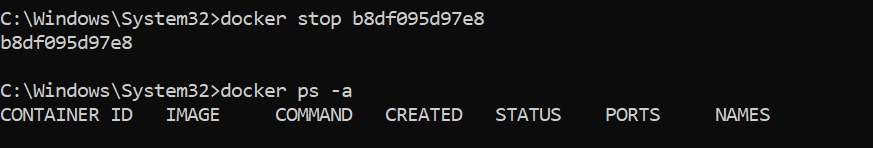
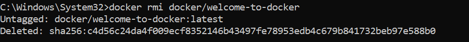

Vérifier la version d'installation de docker avec la commande:
docker --version

Test des commandes de bases:
docker info

docker ps

docker images

docker run

docker run -d --name mon-web-serveur -p 80:80 nginx

docker stop

docker stop mon-web-serveur

Récupérer l’image Docker:

docker pull

docker images

Construction du container Docker
docker run -it --rm -p 8080:80 docker/welcome-to-docker

docker run -it -d --rm -p 8080:80 docker/welcome-to-docker

Arréter le conteneur
On fait docker ps pour lister les conteneurs

On arrete le conteneur a travers son nom ou ID avec docker stop id/nom et on reliste tous les conteneurs avec

Supprimer le conteneur:
docker rm container_id_or_name1
docker ps-a (-a pour all), on voit bien qu'on a plus de conteneur

Supprimer l'image Docker
docker rmi docker/welcome-to-docker

exemple de ligne de commande pour ces actions pour supprimer :
○ Un conteneur spécifique
docker rm container_id_or_name1
○ Plusieurs conteneurs
docker rm container_id_or_name1 container_id_or_name2
○ Tous les conteneurs arrêtés
docker container prune
○ Forcer la suppression d'un conteneur actif
docker rm -f mon-conteneur
○ Une image spécifique
docker rmi nom_image
○ Plusieurs images
docker rmi nom_image1 nom_image2
○ Toutes les images non utilisées
docker image prune
○ Forcer la suppression d'une image
docker rmi -f ID_IMAGE
